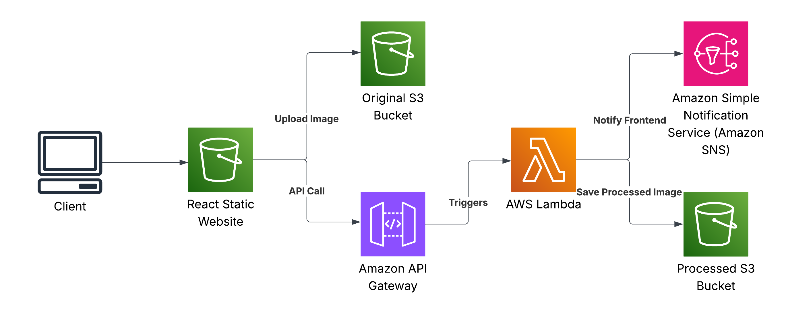

# Serverless Image Processing Platform

A modern, serverless image processing application built with React frontend and AWS Lambda backend, designed for fast and scalable image transformations.

## Table of Contents

- [Solution Overview](#solution-overview)
- [Architecture Diagram](#architecture-diagram)  
- [Features](#features)
- [Project Structure](#project-structure)
- [Prerequisites](#prerequisites)
- [Setup and Deployment](#setup-and-deployment)
  - [1. Clone the Repository](#1-clone-the-repository)
  - [2. Configure AWS Credentials](#2-configure-aws-credentials)
  - [3. Deploy Infrastructure](#3-deploy-infrastructure)
  - [4. Deploy Frontend](#4-deploy-frontend)
- [Usage](#usage)
- [AWS Services Used](#aws-services-used)
- [Cost Optimization](#cost-optimization)
- [Testing](#testing)
- [Clean Up](#clean-up)
- [License](#license)

## Solution Overview

The Serverless Image Processing Platform provides a cost-effective, scalable solution for on-demand image transformations. Built entirely on AWS serverless technologies, it eliminates the need for server management while providing enterprise-grade performance and reliability.

This solution automatically processes uploaded images through a variety of operations including resizing, watermarking, and compression. It uses a modern React frontend hosted on Amazon S3, AWS Lambda for serverless processing, and Amazon SNS for real-time notifications.

The architecture is designed for:
- **Zero server management** - Fully serverless architecture
- **Cost efficiency** - Pay only for actual usage
- **High availability** - Built on AWS managed services
- **Scalability** - Automatically handles traffic spikes
- **Security** - IAM-based access controls throughout

## Architecture Diagram

### Architecture Flow

1. **Client** accesses the React application hosted on S3 Static Website
2. **Frontend** uploads images directly to S3 Original Images bucket via pre-signed URLs
3. **User** selects processing operation (resize/watermark/compress) through the UI
4. **Frontend** calls API Gateway endpoint to trigger image processing
5. **API Gateway** invokes the appropriate Lambda function based on operation type
6. **Lambda** retrieves image from Original S3 bucket, processes it, and saves to Processed S3 bucket
7. **Lambda** publishes completion notification to SNS
8. **SNS** notifies the frontend application
9. **Frontend** displays the processed image to the user

## Features

- **Multiple Processing Operations**
  - **Resize**: Change image dimensions with aspect ratio control
  - **Watermark**: Add text watermarks with customizable position and opacity  
  - **Compress**: Reduce file size with quality optimization
  
- **Modern User Experience**
  - Drag & drop file upload interface
  - Real-time processing status updates
  - Side-by-side original vs processed image preview
  - Responsive design for all device types

- **Enterprise-Ready Architecture**
  - Serverless and auto-scaling
  - Event-driven processing pipeline
  - Secure file handling with pre-signed URLs
  - Infrastructure as Code with Terraform

## Project Structure

